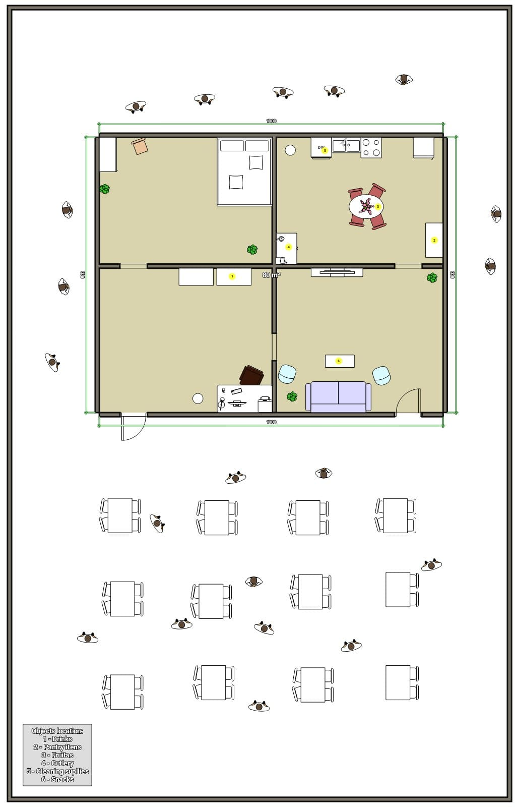
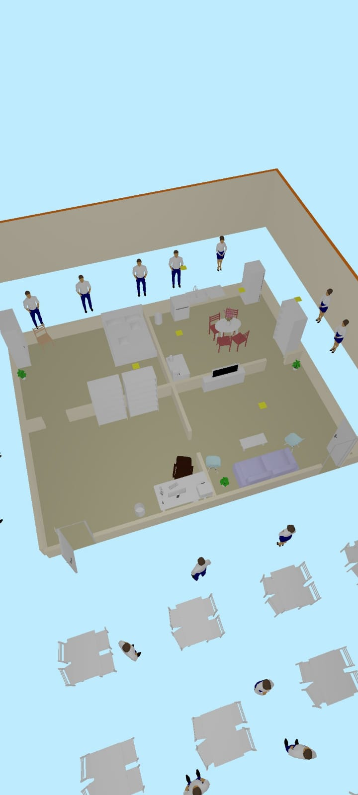
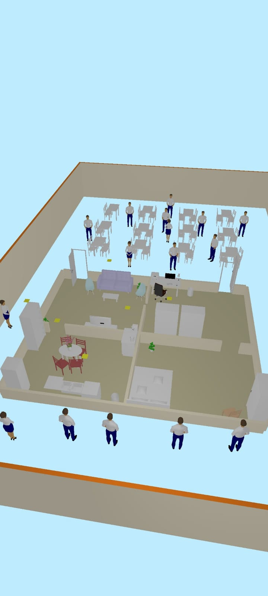
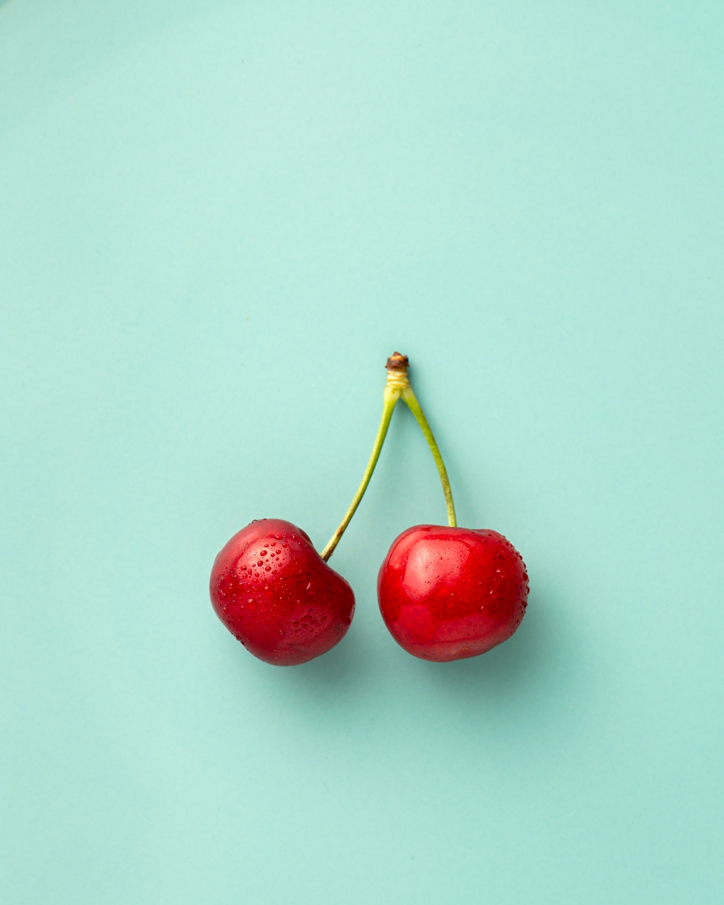

# Robocup@HOME - Brazil - 2022 - São Bernardo Do Campo

- [Scores](Informações-Names.pdf)
- [Schedule](Informações-Schedule.pdf)
- [Person Names](Informações-Names.pdf)
- [Predefined Questions](Informações-Questions.pdf)

## Arena layout:

<table>
  <tr>
    <td></td>
    <td></td>
    <td></td>
<table>

## Tasks setup:

<table>
  <tr>
    <td> Inspection</td>
  </tr>
  <tr>
    <td> Navigation and Follow Me</td>
    <td> Speech Recognition & Audio Detection</td>
    <td> Personal Recognition</td>
    <td> Manipulation and Object Recognition</td>
  </tr>
  <tr>
    <td> Carry My Luggage</td>
    <td> Clean Up</td>
    <td> Receptionist</td>
    <td> Take Out the Garbage</td>
  </tr>

<table>

## Objects:

<table>
  <tr>
    <th>Drinks</th>
    <th>Cleaning supplies</th>
    <th>Pantry items</th>
    <th>Fruits</th>
    <th>Snacks</th>
    <th>Cutlery</th>
  </tr>
  <tr>
    <td> Drinks 1</td>
    <td> Cleaning supplies 1</td>
    <td> Pantry items 1</td>
    <td> Fruits 1</td>
    <td> Snacks 1</td>
    <td> Cutlery 1</td>
  </tr>
  <tr>
    <td> Drinks 2</td>
    <td> Cleaning supplies 2</td>
    <td> Pantry items 2</td>
    <td> Fruits 2</td>
    <td> Snacks 2</td>
    <td> Cutlery 2</td>
  </tr>
  <tr>
    <td> Drinks 3</td>
    <td> Cleaning supplies 3</td>
    <td> Pantry items 3</td>
    <td> Fruits 3</td>
    <td> Snacks 3</td>
    <td> Cutlery 3</td>
  </tr>
</table>

## Others Objects:

<table>
  <tr>
    <td> Bag</td>
    <td> Garbage Bin</td>
    <td> Garbage Lid</td>
    <td> Garbage</td>
  </tr>
<table>

