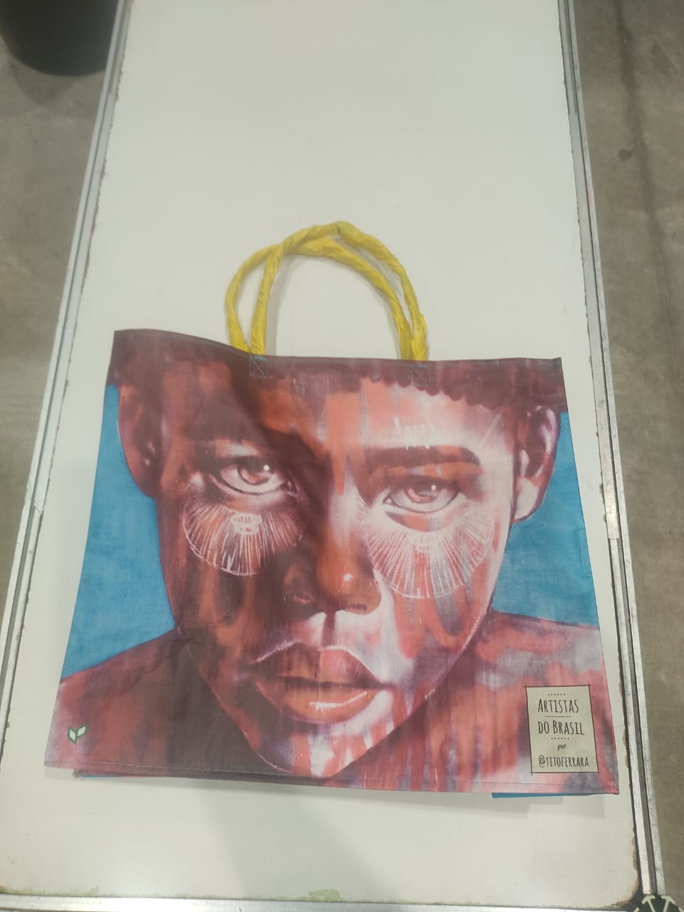

# Robocup@HOME - Brazil - 2023 - Salvador

Table of contents:
- [Scores](Informações-Scores.pdf)
<!-- - [Predefined Questions](Informações-Questions.pdf) -->
- [Schedule](#schedule)
- [Arena layout](#arena-layout)
- [Tasks setup](#tasks-setup)
- [Objects](#objects)
- [Others Objects](others-objects)
- [Person Names](person-names)
- [Questions context](questions-contex)
- [Questions predefined](questions-predefined)

## Schedule

|       | Sab (07/10)    | Dom (08/10)    | Seg (09/10)    | Ter (10/10)    | Qua (11/10)    | Qui (12/10)    |
| ----- | -------------- | -------------- | -------------- | -------------- | -------------- | -------------- |
| 9:00  | Warm-up        | Warm-up        | S1 - SR        | S1 - NF        | S2 - PH        | Final          |
| 9:30  | Warm-up        | Warm-up        | S1 - SR        | S1 - NF        | S2 - PH        | Final          |
| 10:00 | Warm-up        | Warm-up        | S1 - SR        | S1 - NF        |                | Final          |
| 10:30 | Warm-up        | Warm-up        | S1 - SR        | S1 - NF        |                | Final          |
| 11:00 | Warm-up        | Warm-up        | S1 - SR        | S1 - NF        | S2 - PH        | Final          |
| 11:30 | Warm-up        | Warm-up        | S1 - SR        | S1 - NF        | S2 - PH        | Final          |
| 12:00 | lunch          | lunch          | lunch          | lunch          | lunch          | lunch          |
| 12:30 | lunch          | lunch          | lunch          | lunch          | lunch          | lunch          |
| 13:00 | lunch          | lunch          | S1 - MOR       | lunch          | lunch          | lunch          |
| 13:30 | lunch          | lunch          | S1 - MOR       | League picture | lunch          | lunch          |
| 14:00 | Warm-up        | PSWR           | S1 - MOR       | S2 - HK        | S2 - PH        | Award ceremony |
| 14:30 | Warm-up        | PSWR           | S1 - MOR       | S2 - HK        | S2 - PH        | Award ceremony |
| 15:00 | Warm-up        | PSWR           | S1 - MOR       |                |                | Award ceremony |
| 15:30 | Warm-up        | Inspection     | S1 - MOR       | S2 - HK        | S2 - PH        | Award ceremony |
| 16:00 | Warm-up        | Inspection     |                | S2 - HK        | S2 - PH        |                |
| 16:30 | Warm-up        | Inspection.    |                |                |                |                |
| 17:00 | Warm-up        | Team meating 2 | S1 - PR        | S2 - HK        | S2 - Retry     |                |
| 17:30 | Warm-up        |                | S1 - PR        | S2 - HK        | S2 - Retry     |                |
| 18:00 | Team meating 1 | Opening ceremony| S1 - PR        |                |                |                |
| 18:30 |                |                | S1 - PR        | S2 - HK        | S2 - Retry     |                |
| 19:00 |                |                | S1 - PR        | S2 - HK        | S2 - Retry     |                |
| 19:30 |                |                | S1 - PR        | Team meating 4 | Team meating 5 |                |
| 20:00 |                |                | Team meating 3 |                |                |                |

  PSWR = Poster Session and Welcome Reception
  S1 = Stage 1
  S2 = Stage 2
  HK = HouseKeeper
  PH = Party Host
  SR = Speech Recognition
  MOR = Manipulation an Object Recognition
  PR = People Recognition
  NF = Navigation and Follow

| | | | | 
|-----------------|--------------------|---------------------------------|-------------------------------------------------------|
| Team meating 1: | Teams reception    | Discuss this agenda             | Doubts about poster section                           |
| Team meating 2: | Doubts about SR    | Doubts about MOR                | Doubts about PR                                       |
| Team meating 3: | Doubts about NF    | Doubts about HK                 |                                                       |
| Team meating 4: | Doubts about PH    |                                 |                                                       |
| Team meating 5: | Doubts about Final | Election of the next OC members | What do we expect for the next years at robocup@home? |

## Teams

|   | Names                  | Captain           |
| - | ---------------------- | ----------------- |
| 1 | BahiaRT @Home          | Tamir Amorim.     |
| 2 | Warthog Robotics @Home | Rhayna Casado.    |
| 3 | UTBots@Home            | Gustavo Fardo.    |
| 4 | RoboFEI@Home           | Flora Aidar.      |
| 5 | FBots                  | Jardel Dionizio.  |
| 6 | RoboFEI@Work           | ----------------- |
| 7 | PQMEC@HOME             | José Teles.       |
| 8 | PinguimBots@Home       | kristofer Kappel. |

## Arena layout:

<table>
  <tr>
    <td></td>
    <td></td>
    <td></td>
<table>

## Tasks setup:

<table>
  <tr>
    <td> Inspection</td>
  </tr>
  <tr>
    <td> Navigation and Follow Me</td>
    <td> Speech Recognition & Audio Detection</td>
    <td> Personal Recognition</td>
    <td> Manipulation and Object Recognition</td>
  </tr>
  <tr>
    <td> Carry My Luggage</td>
    <td> Clean Up</td>
    <td> Receptionist</td>
    <td> Take Out the Garbage</td>
  </tr>

<table>

## Objects:

<table>
  <tr>
    <th>Drinks</th>
    <th>Cleaning supplies</th>
    <th>Pantry items</th>
    <th>Fruits</th>
    <th>Snacks</th>
    <!-- <th>Cutlery</th> -->
  </tr>
  <tr>
    <td> Nescau</td>
    <td> Detergent</td>
    <td> Gelatin</td>
    <td> Apple</td>
    <td> Treloso</td>
    <!-- <td> Cutlery 1</td> -->
  </tr>
  <tr>
    <td> Kuat</td>
    <td> Sponge</td>
    <td> Mustard</td>
    <td> Pear</td>
    <td> Chocolate</td>
    <!-- <td> Cutlery 2</td> -->
  </tr>
  <tr>
    <td> Cononut water</td>
    <td> Cloth</td>
    <td> Shoyo</td>
    <td> Tangerine</td>
    <td> Peanut</td>
    <!-- <td> Cutlery 3</td> -->
  </tr>
  <tr>
    <td> Fanta</td>
    <td> </td>
    <td> Sauce</td>
    <td> </td>
    <td> </td>
    <!-- <td> Cutlery 3</td> -->
  </tr>
  <tr>
    <td> </td>
    <td> </td>
    <td> Tea</td>
    <td> </td>
    <td> </td>
    <!-- <td> Cutlery 3</td> -->
  </tr>
</table>

## Others Objects:

<table>
  <tr>
    <td> Bag</td>
    <td> Garbage Bin</td>
    <td> Garbage Lid</td>
    <td> Garbage</td>
  </tr>
<table>

## Person Names:

|    | Male        | Female    |
| -- | ----------- | --------- |
| 1  | James       | Mary      |
| 2  | Robert      | Patricia  |
| 3  | John        | Jennifer  |
| 4  | Michael     | Linda     |
| 5  | David       | Elizabeth |
| 6  | William     | Barbara   |
| 7  | Richard     | Susan     |
| 8  | Joseph      | Jessica   |
| 9  | Thomas      | Sarah     |
| 10 | Christopher | Karen     |

## Questions - context

The RoboCup@Home league

The RoboCup@Home league aims to develop robotic service and assistance technology with high relevance for future personal home applications. It is the largest annual international competition for autonomous service robots and is part of the RoboCup initiative. A set of benchmark tests is used to evaluate the robots' abilities and performance in a realistic, non-standard home environment. The focus is on the following domains, but is not limited to: Human-Robot Interaction and Cooperation, Navigation and Mapping in dynamic environments, Computer Vision and Object Recognition under natural light conditions, Object Manipulation, Adaptive Behaviors, Behavior Integration, Environmental Intelligence, Standardization and Systems Integration. It is co-located with the RoboCup symposium.

Who can participate?

Anyone with an independent robot can participate. The @Home league consists of a few tests and an open challenge to demonstrate your robot's skills. To participate in the open challenge it is necessary to participate in at least one test. The competition takes place in a real-world setting.

The competition

The RoboCup@Home competition consists of tests that robots must solve. The tests change over the years to become more advanced and act as a general measure of quality in the desired areas. Performance measurement is based on a score derived from competition rules and assessment by a jury.

Test criteria are listed below:
include human-robot interaction
be socially relevant
be application-directed/oriented
be scientifically challenging
be simple and have self-explanatory rules
be interesting to watch

The scenario

The final setting is the real world itself. To gradually develop possible technologies, a basic home environment is provided as a general setting. In the first years (we started in 2006) it consisted of a living room and a kitchen but soon it also began to involve other areas of daily life, such as a garden/park area, a store, a street or other public places.

Finals

RoboCup@Home ends with the finals where the teams with the highest points can play in the scenario that has been created. Teams are evaluated by a jury made up of roboticists and non-roboticists, such as people from industry, human-machine interaction, industrial design, the public and the press. The classification of the finals determines the winner. In the finals there is less focus on technical issues, as reaching the finals already means that the teams are very good at a technical level.

—————————————————————————————————————

BAHIA

Bahia is a Brazilian state located in the Northeast Region. The population of Bahia is 14.9 million inhabitants, the fourth largest in Brazil. The municipality of Salvador is the state capital and also served as the first Brazilian capital between 1549 and 1763. The state's geography is characterized by plains and depressions, as well as two dominant climate types, tropical and semi-arid. Bahia's economy is the main one in the Northeast and focuses on the tertiary sector and the manufacturing industry.

Bahia climate
Two climate types are predominant in Bahia. The first is the semi-arid, which occurs in the central region (with the exception of the highest areas) and part of the west of the state. This climate is characterized by high temperatures and low relative humidity, with irregular precipitation and a dry period generally in the winter months. Rainfall is concentrated in the summer, with an annual average of around 800 mm. The tropical climate occurs mainly in the east of Bahia, also marked by high annual temperatures and a higher level of humidity, especially on the coast. Average annual precipitation varies between 1,200 and 1,600 mm. In some coastal cities, this value can exceed 2,000 mm.

Relief of Bahia
Plateaus and depressions are the predominant forms of relief in Bahia, which gives most of the state elevations above 300 meters.
The west of Bahia and part of the north are part of the Depression Sertaneja and São Francisco, to the east of which the Plateaus and Serras do Leste-Sudeste extend. The highest terrain in the state is located in this domain, with emphasis on Serra do Espinhaço and Chapada Diamantina. This is where the highest point of Bahia and the Northeast is located: Pico do Barbado, 2,033 meters above sea level. In the eastern range, finally, we have the Coastal Plains and Tablelands.

## Questions Predefined

| General (simple) questions:      |  | |
| -------------------------------- | --- | --- |
| 1                                | What is the hero’s name in The Legend of Zelda? | Despite most people’s believes, he’s called Link |
| 2                                | What are the names of the ghosts who chase Pac Man and Ms. Pac Man? | Inky, Blinky, Pinky, and Clyde |
| 3                                | What’s the name of the Mythbusters’ crash test dummy? | The Mythbusters’ crash test dummy is called Buster |
| 4                                | What is an Oxford comma? | The hotly contested punctuation before a conjunction in a list |
| 5                                | Who was the captain of the Enterprise in the pilot episode of Star Trek? | The captain of the Enterprise in the pilot episode was Captain Pike |
| 6                                | What is the symbol for the modulus operator in C? | The percentage symbol is used as modulus operator in C |
| 7                                | What function is automatically called at the beginning of a C++ program? | The main function |
| 8                                | Which computer programming languages was introduced by IBM in 1957? | Fortran was introduced by IBM in 1957 |
| 9                                | Who is considered as the first programmer? | The first programmer was Ada Lovelace |
| 10                               | Has a robot ever killed a person? | The first known case of robot homicide occurred in 1981, when a robotic arm crushed a Japanese Kawasaki factory worker |
| 11                               | Who was HitchBOT? | A hitchhiking robot that relied on the kindness of strangers to travel the world and was slain by humans |
| 12                               | Are self-driving cars safe? | Yes. Car accidents are product of human misconduct |
| 13                               | Who invented the compiler? | Grace Hoper. She wrote it in her spare time |
| 14                               | Who created the Python Programming Language? | Python was invented by Guido van Rossum |
| 15                               | Is Mark Zuckerberg a robot? | Sure. I’ve never seen him drink water |
| 16                               | Why did you run away? | I heard an electric can opener |
| 17                               | What kind of salad do robots like? | Salads made with ice-borg lettuce. |
| 18                               | What did you ate for lunch? | I had a byte |
| 19                               | Why did robots get angry so often? | People kept pushing our buttons. |
| 20                               | Why shouldn’t R2D2 be allowed in movies? | He says so many foul words they have to bleep everything he says! |
| 21                               | What’s your favorite style of music? | I like electronic and heavy Metal |
| General (complex) questions:     |
| 22                               | What does the acronym SMTP represent? | SMTP stands for Simple Mail Transport Protocol |
| 23                               | What does the acronym MPEG represent? | MPEG stands for Moving Picture Experts Group |
| 24                               | What does the acronym GIMP represent? | GNU Image Manipulation Program |
| 25                               | What does the acronym GNU represent? | GNU is a recursive acronym meaning GNU is Not Unix |
| Questions about Brazil (simple): |
| 26                               | What is the most populous city in Brazil? | São Paulo is the most populous city in Brazil with 12.03 million residents. |
| 27                               | Which continent is Brazil located in? | The Brazilian territory is located on the South American continent. |
| 28                               | On what day, month and year was Brazil’s independence de- clared? | On September 7, 1822, Brazil’s independence was declared. |
| 29                               | How many states does Brazil have (with Federal District)? | Currently, Brazil is divided into 26 states and the Federal District, altogether there are 27 federative units. |
| 30                               | In what year did the first Brazilian astronaut go to space? | In March 2006, Pontes became the first Brazilian to go to space. |
| 31                               | What is the only capital of Brazil crossed by the Equator? | Macapá is the only Brazilian capital crossed by the Equator line. |
| 32                               | How many time zones are there in Brazil? | Brazil is a country with continental dimensions, in all it has four time zones. |
| 33                               | In which city is the world’s first urban elevator and what is the name of that elevator? | The Lacerda Elevator is a public urban elevator located in Salvador, Brazil. |
| 34                               | What is the only biome present in Brazil that is exclusive in the world? | The Caatinga, characterized by its dry, desert habitat is the only one of Brazil’s biomes found exclusively within the country. |
| 35                               | Pampulha Lake is a tourist spot in which Brazilian city? | Belo Horizonte |
| 36                               | What is the smallest Brazilian state in territorial extension? | Sergipe |
| 37                               | Which capitals in Brazil have the same name as your state? | São Paulo and Rio de Janeiro |
| 38                               | Where is the Itamaraty Palace located? | Brasília |
| 39                               | What was the first name given to Brazil by the Portuguese? | Ilha de vera Cruz |
| Questions about Brazil (simple): |
| 40                               | What is the Newest State in Brazil? | Tocantins |
| 41                               | What is the oldest state in Brazil? | Pernambuco |
| 42                               | What is the capital of Ceará? | Fortaleza |
| 43                               | What is the capital of Rio Grande do Sul? | Porto alegre |
| 44                               | What is the capital of Rio Grande do Norte? | Natal |
| 45                               | What is the capital of Brazil? | Brasília |
| 46                               | What is the capital of Pernambuco? | Recife |
| 47                               | What is the capital of Pará? | Belém |
| Questions about Bahia (simple):  |
| 48                               | What is the capital of Bahia? | Salvador |
| 49                               | Acarajé is a typical food from which state? | Bahia |
| 50                               | What are the colors of Bahia's flag? | White, red and blue |
| 51                               | What are some typical foods from Bahia? | Caruru, vatapá, abará and acarajé. |
| 52                               | What is the most popular rhythm in Bahia, played mainly during the Bahian Carnival? | Axé or pagode. |
